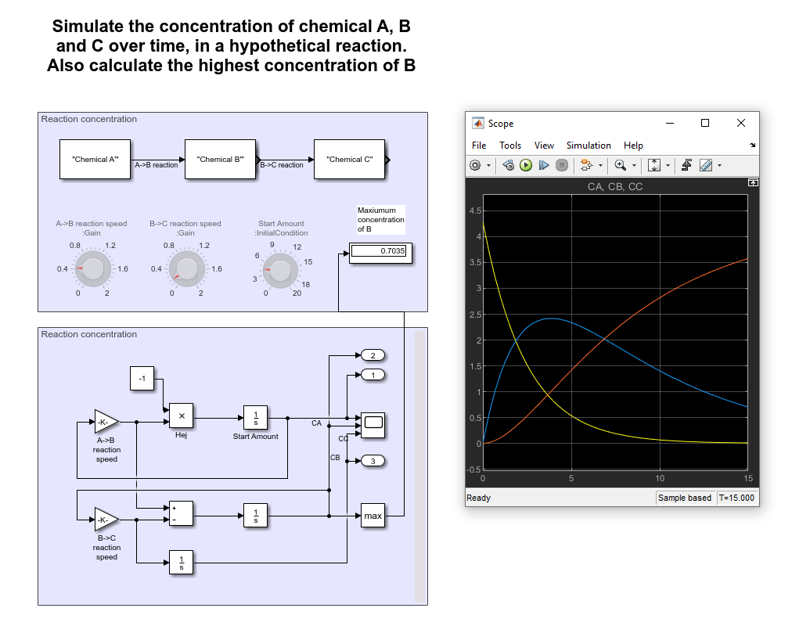

# Matlab-Projects

This neat little program will simulate a chemical reaction with the mysteriuos chemicals A, B, and C

Basically, just some differential equations glued together with a giant "chemistry" label all over.

Can also simulate the Iodine clock reaction which is pretty cool i guess
